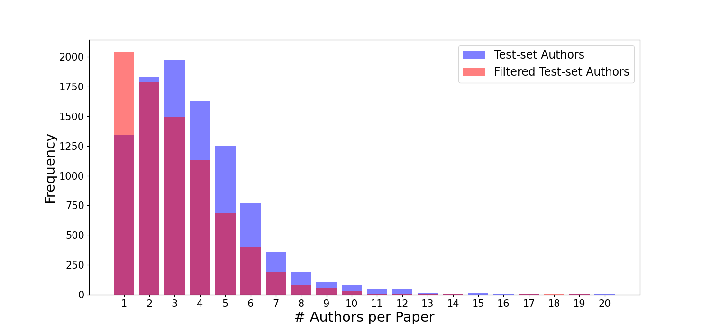

# exHarmony: Authorship and Citations for Benchmarking the Reviewer Assignment Problem

This repository contains the code and data for the paper "Authorship and Citations for Benchmarking the Reviewer Assignment Problem" and the "exHarmony" dataset.
It should be noted that due to the size of the dataset, we are unable to provide the full dataset in this repository.
Hence, the repository contains the codes for the sake of reproducibility and the data are available on Google Drive.

By following the instructions below, you can download the dataset and run files to either reproduce the results or use
the dataset for your research.

## Dataset

This figure represents the number of papers and their authors before and after the filtering step in the test set. More specifically, the blue bars represent the histogram of papers with $N$ number of authors in the test set. Since the authors in the collection are those who have had any publications before time $\tau$, some authors might not exist in the collection. As such, they cannot be used as the gold standard for evaluation. Therefore, we remove any papers for which none of their authors exist in the collection. The red bars represent the number of authors per paper after filtering out papers with no authors. After filtering, there remain 7,944 papers in our test set.



### Download the dataset

To download the dataset from Google Drive, you can use the following commands:

Note: You need to install the `gdown` package to download the dataset.

```bash
pip install gdown
```

If you already have the `gdown` package installed, you can use the following commands to download the dataset:

```bash
cd exHarmony/
gdown --folder https://drive.google.com/drive/folders/1ZukiOXKn-Hdxdhd4oOMy57RVdyz-XTar?usp=sharing
```

Now you have the dataset files in the `data` directory.

### Dataset Files

| Description            | File Name                        | File Size | Num Records | Format                                                                 |
|------------------------|----------------------------------|-----------|-------------|------------------------------------------------------------------------|
| Collection             | papers_collection.tsv            | 1.5 GB    | 1,204,150   | TSV: paper_id, title, abstract                                         |
| Test                   | papers_test.tsv                  | 14 MB     | 7,944       | TSV: paper_id, title, abstract                                         |
| Authors' Works Mapping | authors_works_collection_ids.tsv | 193 MB    | 1,589,723   | TSV: author_id, list_of_authors_papers                                 |
| Authors' Information   | authors_info.pkl                 | 126 MB    | 1,589,723   | Pickle: A dictionary with ids as keys and author information as values |

All `tsv` formatted files are also available in the `pkl` format for faster loading and getting rid of the text parsing
overhead. Each `pkl` file contains a list of dictionaries, where each dictionary corresponds to a row in the `tsv` file.

### File Descriptions

It is now possible to access the exHarmony dataset in the `data` folder. Here are the files it contains:

- `papers_collection.tsv`: Contains information about the papers that have been used to build the index for the author
  retrieval task.
    - Here is a sample row from the file:
      ```
      https://openalex.org/W4323317762        Sharding-Based Proof-of-Stake Blockchain Protocols: Key Components & Probabilistic Security Analysis        Blockchain technology has been gaining great interest from a variety of sectors including healthcare, supply chain, and cryptocurrencies. However, Blockchain suffers from a limited ability to scale (i.e., low throughput and high latency). Several solutions have been proposed to tackle this. In particular, sharding has proved to be one of the most promising solutions to Blockchain's scalability issue. Sharding can be divided into two major categories: (1) Sharding-based Proof-of-Work (PoW) Blockchain protocols, and (2) Sharding-based Proof-of-Stake (PoS) Blockchain protocols. The two categories achieve good performances (i.e., good throughput with a reasonable latency), but raise security issues. This article focuses on the second category. In this paper, we start by introducing the key components of sharding-based PoS Blockchain protocols. We then briefly introduce two consensus mechanisms, namely PoS and practical Byzantine Fault Tolerance (pBFT), and discuss their use and limitations in the context of sharding-based Blockchain protocols. Next, we provide a probabilistic model to analyze the security of these protocols. More specifically, we compute the probability of committing a faulty block and measure the security by computing the number of years to fail. We achieve a number of years to fail of approximately 4000 in a network of 4000 nodes, 10 shards, and a shard resiliency of 33%
      ```

- `papers_test.tsv`: Contains the test set for the author retrieval task.
    - Here is a sample row from the file:
      ```
      https://openalex.org/W4382568152        Routing, Channel, Key-Rate, and Time-Slot Assignment for QKD in Optical Networks        Quantum Key Distribution (QKD) is currently being explored as a solution to the threats posed to current cryptographic protocols by the evolution of quantum computers and algorithms.However, single-photon quantum signals used for QKD permit to achieve key rates strongly limited by link performance (e.g., loss and noise) and propagation distance, especially in multinode QKD networks, making it necessary to design a scheme to efficiently and timely distribute keys to the various nodes.In this work, we introduce the new problem of joint Routing, Channel, Key-rate and Time-slot Assignment (RCKTA), which is addressed with four different network settings, i.e., allowing or not the use of optical bypass (OB) and trusted relay (TR).We first prove the NP-hardness of the RCKTA problem for all network settings and formulate it using a Mixed Integer Linear Programming (MILP) model that combines both quantum channels and quantum key pool (QKP) to provide an optimized solution in terms of number of accepted key rate requests and key storing rate.To deal with problem complexity, we also propose a heuristic algorithm based on an auxiliary graph, and show that it is able to obtain nearoptimal solutions in polynomial time.Results show that allowing OB and TR achieves an acceptance ratio of 39% and 14% higher than that of OB and TR, respectively.Remarkably, these acceptance ratios are obtained with up to 46% less QKD modules (transceivers) compared to TR and only few (less than 1 per path) additional QKD modules than OB.
      ```

- `authors_works_collection_ids.tsv`: Contains the mapping between authors and their works in the index.
    - Here is a sample row from the file:
      ```
      https://openalex.org/A5083262615        ['https://openalex.org/W4323317762', 'https://openalex.org/W4285189682', 'https://openalex.org/W2994826096', 'https://openalex.org/W3090464427', 'https://openalex.org/W3039746697', 'https://openalex.org/W2955700129', 'https://openalex.org/W4313679422', 'https://openalex.org/W4310681652', 'https://openalex.org/W4311152538']
      ```
- `authors_info.tsv`: Contains the information about the authors in the index.
    - Here is a sample item from the dictionary:
      ```
      https://openalex.org/A5083262615: {'citations': 238, 'works_count': 14, 'experience_years': 5, 'institution': 'Université de Montréal'}
      ```

## Qrel Files

In this dataset, we approached the reviewer assignment problem by defining and evaluating multiple qrels, each
reflecting a different strategy for identifying relevant authors to assign to papers. These qrels were designed to
capture distinct perspectives on relevance, enabling a comprehensive evaluation of our retrieval models. We evaluated
five primary qrel sets, each representing unique relationships between papers and authors. The first qrel set considers
each paper's authors as relevant authors, while the second defines relevance based on authors of the most similar papers
within the test set. The third set uses citation information, marking as relevant the authors of works cited by each
paper. To refine the citation-based approach, the fourth set limits the relevant authors to those associated with the
top 10 most similar cited papers. Additionally, an aggregated set combines the first and second sets, broadening the
definition of relevance by combining authors of both the paper itself and the most similar paper. Each primary qrel was
further filtered to retain only “experts” — defined as authors with more than 15 publications — resulting in a total of
ten qrel sets. This multi-faceted approach allowed us to evaluate model performance across various interpretations of
relevance.

| Qrel Set                           | Description                                                                | Number of Pairs | Filename                  |
|------------------------------------|----------------------------------------------------------------------------|-----------------|---------------------------|
| Paper Authors                      | Authors of each paper are considered relevant.                             | 33,120          | `qrels_paper_authors.txt` |
| Most Similar Paper Authors         | Authors of the most similar paper in the test set are considered relevant. | 37,419          | `qrels_similar_paper.txt` |
| Cited Works Authors                | Authors of works cited by each paper are considered relevant.              | 695,271         | `qrels_cited_works.txt`   |
| Top 10 Cited Similar Works Authors | Authors of the top 10 similar cited works are considered relevant.         | 202,904         | `qrels_top10_cited.txt`   |
| Aggregated Authors                 | Combination of authors from the paper and the most similar paper.          | 70,539          | `qrels_aggregated.txt`    |

Each of these sets is further filtered to include only “expert” authors, resulting in ten final qrel sets for a more
targeted evaluation of the retrieval models.

## Run Files
While you can easily reproduce the results by running the codes for each model, we also provide the run files for each one to make it easier for you to reevaluate the models. The run files contain the top 100 authors for each paper in the test set. All run files that have been used in the paper had been uploaded to Google Drive. You can download them by following the instructions below.

The models that have been used in the paper are as follows:

- `BM25`
- `Doc2Vec`
- `Word Movers' Distance`
- `BERT`: A BERT model that has been trained on the MS MARCO dataset.
- `MiniLM`: A MiniLM model that has been trained on the MS MARCO dataset.
- `SciBERT`
- `SPECTER`
- `SciBERT`: A SciBERT model that has been trained on the scholarly literature.

### Download the run files

To download the run files from Google Drive, you can use the following commands:

```bash
cd exHarmony/
gdown --folder https://drive.google.com/drive/folders/1mOqE8EMV-WQNfCLtzO6oqvckNto3jzEs?usp=sharing
```

Now you have the run files in the `run_files` directory.

## Abstract

The peer review process is crucial for ensuring the quality and reliability of scholarly work, yet assigning suitable reviewers remains a significant challenge. Traditional manual methods are labor-intensive and often ineffective, leading to unconstructive or biased reviews. This paper introduces the exHarmony benchmark, designed to address these challenges by reimagining the Reviewer Assignment Problem (RAP) as a retrieval task. Utilizing the extensive data from OpenAlex, we propose a novel approach that considers an author as the best potential reviewer for their own paper. This allows us to evaluate and improve reviewer assignment without needing explicit labels. We benchmark various methods, including traditional lexical matching, static neural embeddings, and contextualized neural embeddings, and introduce evaluation metrics that assess both relevance and diversity. Our results indicate that while traditional methods perform reasonably well, contextualized embeddings trained on scholarly literature show the best performance. The findings underscore the importance of further research to enhance the diversity and effectiveness of reviewer assignments.
